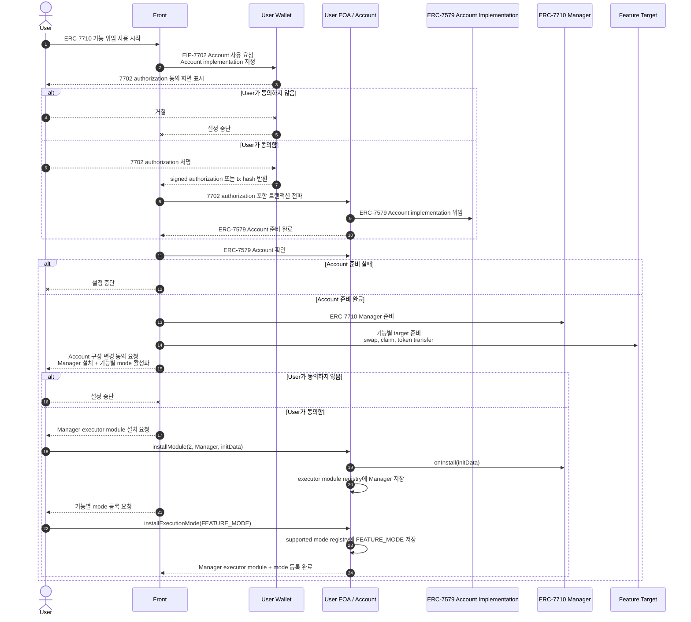
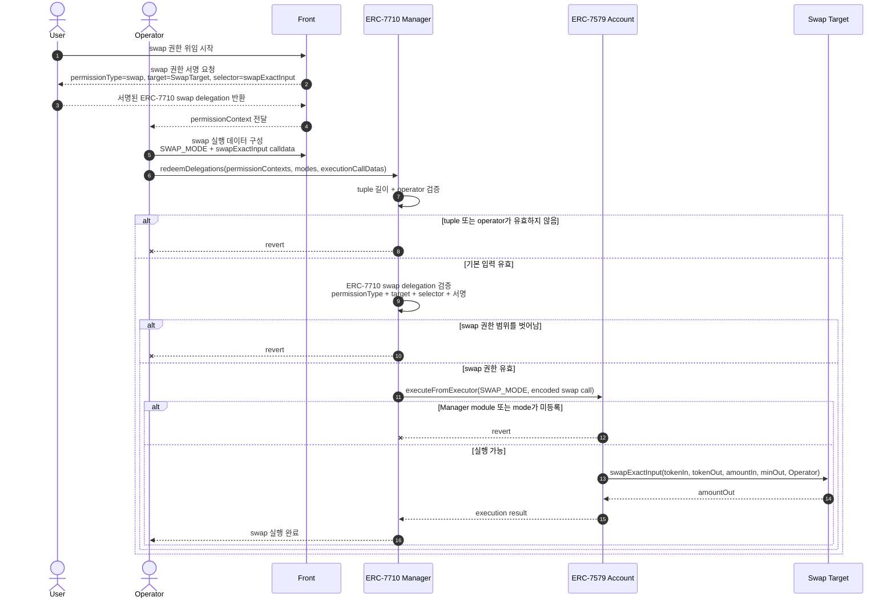
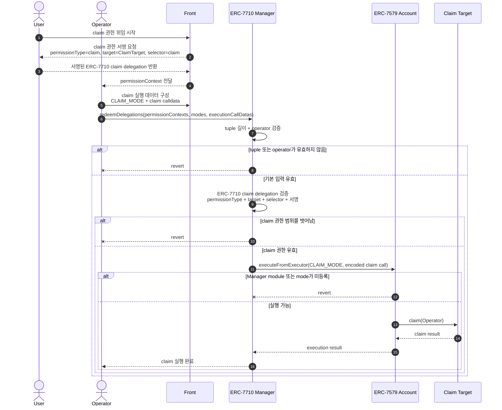
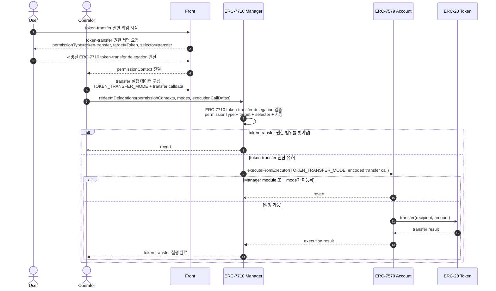

# ERC-7710 Manager와 ERC-7579 Account 기능별 실행 흐름

ERC-7710은 `swap`, `token-transfer`, `claim` 같은 기능을 표준화된 권한 타입으로 분리합니다. 
이 구조에서는 User가 전체 지갑 권한을 넘기지 않고, 필요한 기능만 Operator에게 위임할 수 있습니다.

전체 흐름은 세 단계로 나뉩니다. 
1. EIP-7702 Account 사용에 동의 
2. mode 활성화에 동의 
3. 기능별 ERC-7710 delegation에 서명하면 Operator가 허용된 call을 실행

## 1. Setting



## 2. Function mapping

| 기능 | permissionType | target | selector | 실행 결과 |
| --- | --- | --- | --- | --- |
| swap | `PERMISSION_TYPE_SWAP` | Swap target | `swapExactInput(address,address,uint256,uint256,address)` | token swap 실행 |
| claim | `PERMISSION_TYPE_CLAIM` | Claim target | `claim(address)` | claim 실행 |
| token transfer | `PERMISSION_TYPE_TOKEN_TRANSFER` | ERC-20 token 또는 transfer module | `transfer(address,uint256)` 등 | token transfer 실행 |

공통 ERC-7710 delegation 필드는 기능마다 동일합니다.

```text
delegator      = User의 ERC-7579 Account
operator       = 위임받은 실행자
permissionType = 기능별 권한 타입
target         = 기능별 호출 대상
selector       = 기능별 허용 selector
authority      = ROOT_AUTHORITY
signature      = User 또는 account owner의 EIP-712 서명
```

## 3. Swap



## 4. Claim



## 5. Token Transfer



## 핵심 포인트

- 프론트의 첫 Account 관련 요청은 EIP-7702 Account 사용 동의입니다.
- 프론트가 User 지갑에 `installModule(2, manager, initData)` 트랜잭션을 요청해 ERC-7710 Manager를 executor module로 설치합니다.
- ERC-7579 Account에서는 실행에 사용할 mode도 지원 mode로 등록되어 있어야 합니다.
- 7702 동의는 Account 사용 준비에 대한 동의, 세팅 동의는 Account 구성 변경에 대한 동의, 기능별 위임은 ERC-7710 delegation 서명입니다.
- 문서의 `SWAP_MODE`, `CLAIM_MODE`, `TOKEN_TRANSFER_MODE`는 프론트 레벨 이름이며, 실제 on-chain 값은 ERC-7579 Account가 지원하는 encoded mode입니다.
- 권한을 위임받은 operator는 call 시점에 서명된 ERC-7710 delegation을 제출합니다.
- `permissionContexts`는 `Account -> Operator` 단일 delegation을 ABI 인코딩한 값입니다.
- ERC-7710 Manager는 ERC-7710 delegation의 `permissionType`, `target`, `selector`, EIP-712 서명, `ROOT_AUTHORITY`를 검증합니다.
- delegator가 EOA면 ECDSA로 검증하고, contract면 ERC-1271 `isValidSignature`로 검증합니다.
- 검증이 끝나면 ERC-7710 Manager가 ERC-7579 Account의 `executeFromExecutor`를 호출합니다.
- 실제 기능 call은 ERC-7579 Account가 수행합니다.
